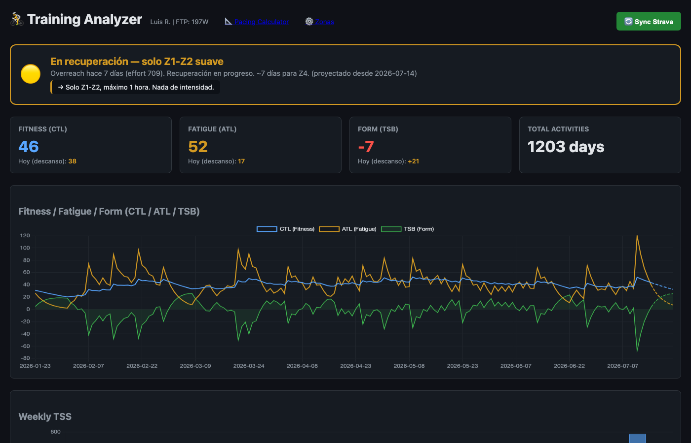
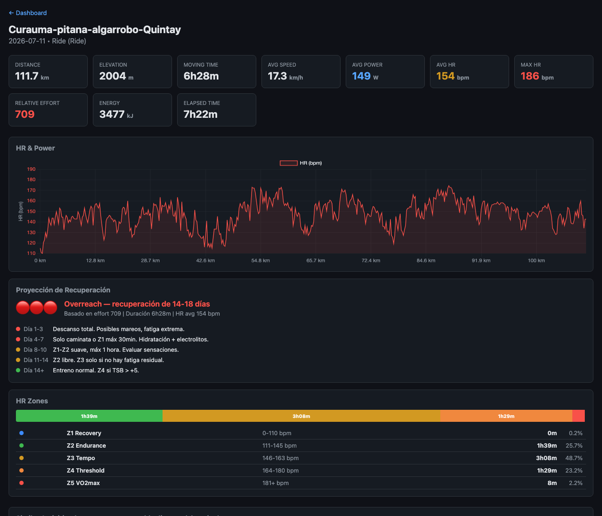
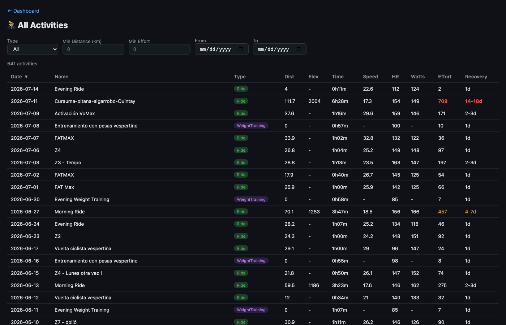
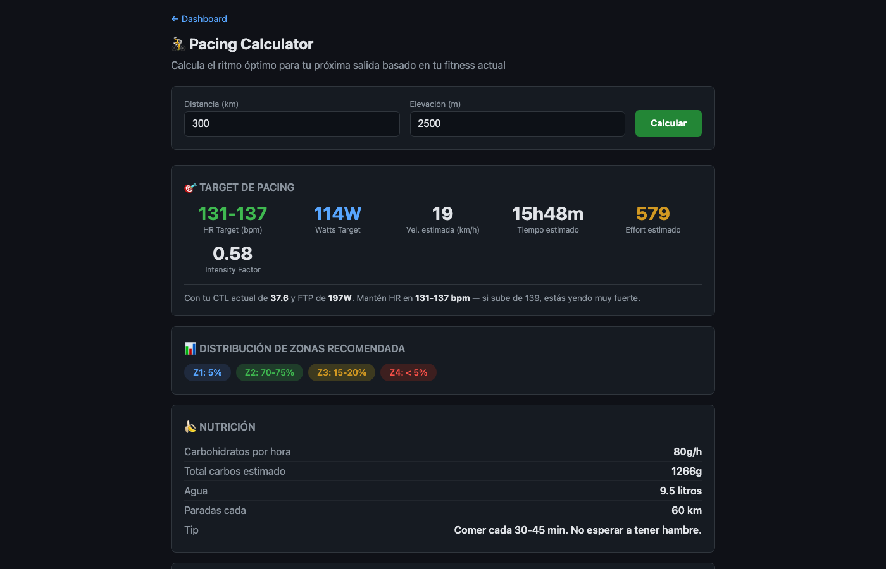
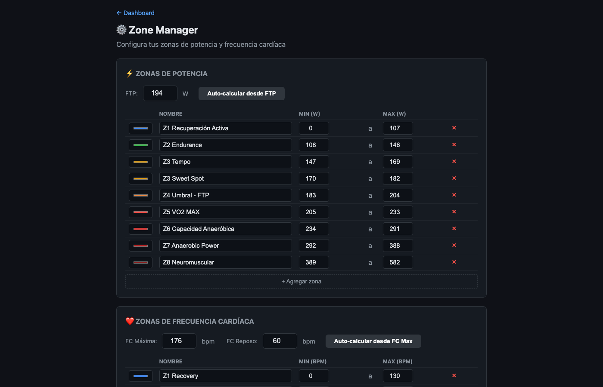

# 🚴 Strava Training Analyzer

Personal training analytics app that connects to Strava to download, organize, and analyze your cycling data. Built for cyclists who want deeper insights than Strava provides.

  

🇪🇸 [Versión en español](README.es.md)

## Features

- **📊 Training Load Dashboard** — CTL/ATL/TSB chart with rest-day projection
- **🎯 Readiness Indicator** — Know if your body is ready for intensity or needs rest (accounts for overreach)
- **📈 Activity Detail** — HR & Power streams, time-in-zones, recovery projection
- **🔍 Activity Comparison** — Find similar rides and compare metrics side by side
- **📐 Pacing Calculator** — Get target HR/watts/speed for any planned ride
- **⚙️ Zone Manager** — Configure custom power and HR zones
- **🔄 Strava Sync** — One-click sync with incremental updates
- **🏔️ Overreach Detection** — Alerts when you've gone too hard based on historical patterns

## Screenshots

### Dashboard
CTL/ATL/TSB chart with readiness indicator and weekly TSS



### Activity Detail
HR streams, zone distribution, recovery projection, and similar rides



### All Activities
Sortable, filterable list of all your activities with recovery estimates



### Pacing Calculator
Target HR/watts/speed for any planned ride based on your current fitness



### Zone Manager
Configure custom power and HR zones with auto-calculation



## Quick Start

### Prerequisites

- Python 3.11+
- A Strava account with a registered API app ([create one here](https://www.strava.com/settings/api))

### Installation

```bash
# Clone the repo
git clone https://github.com/lramirezq/strava-analizer.git
cd strava-analizer

# Create virtual environment
python3 -m venv .venv
source .venv/bin/activate

# Install dependencies
pip install -e ".[dev]"

# Configure your Strava credentials
cp .env.example .env
# Edit .env with your Client ID and Client Secret
```

### First Run

```bash
# 1. Authenticate with Strava (opens browser)
python -m app.auth

# 2. Download all your activities
python -m app.sync

# 3. Start the dashboard
uvicorn app.server:app --port 8050

# Open http://localhost:8050
```

### macOS App (standalone)

You can build a standalone macOS app that doesn't require Python:

```bash
pip install pyinstaller
pyinstaller strava_analyzer.spec --noconfirm
# Result: dist/Strava Analyzer.app (~62MB)
```

## Configuration

### Strava API Credentials

1. Go to [strava.com/settings/api](https://www.strava.com/settings/api)
2. Create an app (or use existing)
3. Set "Authorization Callback Domain" to `localhost`
4. Copy Client ID and Client Secret to your `.env` file

### Power Zones

Navigate to `/zones` in the dashboard to configure your power and HR zones. Supports auto-calculation from FTP and max HR.

### Metrics

| Metric | Description |
|---|---|
| CTL | Chronic Training Load — 42-day rolling fitness |
| ATL | Acute Training Load — 7-day rolling fatigue |
| TSB | Training Stress Balance — CTL minus ATL (form) |
| TSS | Training Stress Score — intensity × duration |

## Project Structure

```
strava-analizer/
├── app/
│   ├── __init__.py
│   ├── config.py          # Configuration & environment
│   ├── db.py              # SQLite database layer
│   ├── metrics.py         # TSS/CTL/ATL/TSB calculations
│   ├── server.py          # FastAPI endpoints
│   ├── strava_client.py   # Strava API client with OAuth
│   ├── auth.py            # OAuth2 authentication flow
│   ├── sync.py            # Activity sync from Strava
│   └── templates/         # HTML dashboard pages
├── tests/
│   └── test_db.py
├── docs/
│   ├── PRD.md
│   ├── specs/
│   └── adr/
├── main.py                # Standalone app entry point
├── strava_analyzer.spec   # PyInstaller build spec
├── pyproject.toml
├── .env.example
└── .gitignore
```

## API Endpoints

| Endpoint | Description |
|---|---|
| `GET /` | Dashboard (or setup wizard if not configured) |
| `GET /activities` | All activities list with sorting/filtering |
| `GET /activity?id=X` | Activity detail with zones and streams |
| `GET /pacing` | Pacing calculator |
| `GET /zones` | Zone configuration manager |
| `GET /api/training-load` | CTL/ATL/TSB time series JSON |
| `GET /api/readiness` | Current training readiness assessment |
| `GET /api/activity/{id}/zones` | HR & power zone distribution |
| `GET /api/activity/{id}/streams` | HR & power time series data |
| `GET /api/pacing-calculator` | Calculate pacing for target ride |
| `POST /api/sync` | Trigger Strava sync |
| `POST /api/zones/config` | Save zone configuration |

## Tech Stack

- **Backend:** Python, FastAPI, Pandas, NumPy
- **Frontend:** HTML, Chart.js (no JS framework)
- **Storage:** SQLite
- **Auth:** Strava OAuth2
- **Packaging:** PyInstaller (macOS app)

## Privacy

- All data stays on your machine (SQLite database)
- Tokens stored locally, never transmitted to third parties
- No analytics, no tracking, no cloud dependency
- API calls only go to Strava's official API

## License

MIT

## Contributing

Contributions welcome! Please open an issue first to discuss what you'd like to change.
